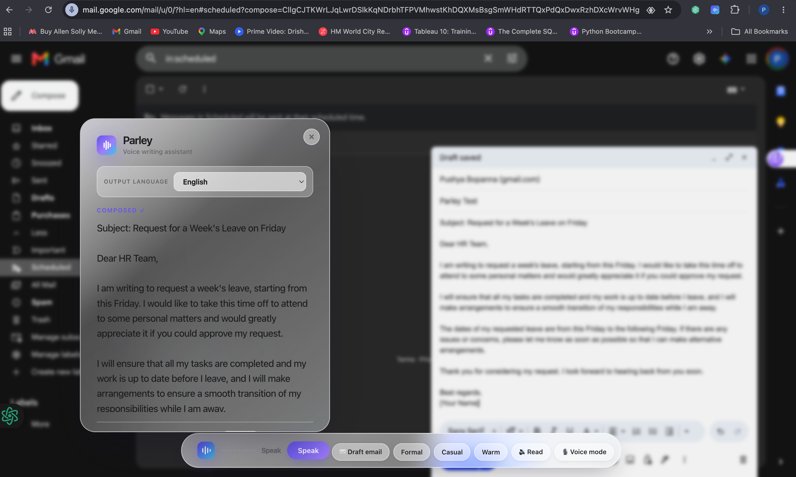
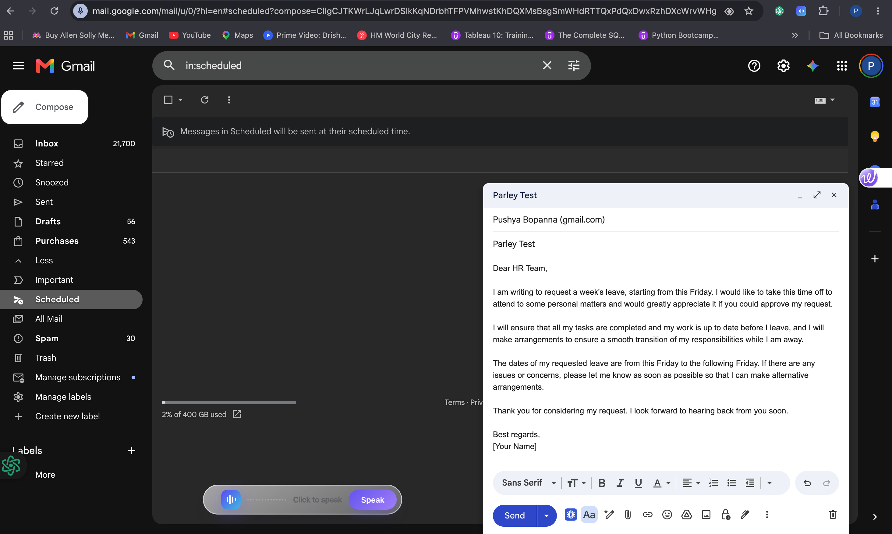

# Parley

**The voice assistant you talk with** — dictate, rewrite, translate, and talk back on any page. Parley is a Chrome extension with a local Node backend: click the floating pill, speak, and your words appear where your cursor is. Go further with conversational **Voice mode**, the **Hey Parley** wake word, Gmail-aware replies, and an Apple-grade glass UI.

**Current version:** `1.2.5`

## Features

| Feature | What it does |
|---------|----------------|
| **Dictation** | Live speech-to-text into any focused field (`input`, `textarea`, `contenteditable`) |
| **Draft email & tone** | Turn speech into a formatted email or refine tone (formal, casual, warm, fix grammar) |
| **Translation** | After dictation, translate output to Hindi, Spanish, French, and more |
| **Gmail context** | **Reply in context** scrapes the thread and drafts a reply that fits the conversation |
| **Read aloud** | PyAI Speak reads your text back |
| **Hey Parley** | Wake word — click the page once, then say “Hey Parley” to start dictating |
| **Field hint** | A 🎙 Speak chip appears next to focused inputs |
| **Voice mode** | Talk naturally; Parley listens, **speaks back** (“Sure, let me do that”), and obeys commands like “write this as an email” |
| **Settings sync** | Popup toggles persist across tabs via `chrome.storage` + background service worker |
| **Premium UI** | Frosted-glass panel, spring animations, iOS-style popup toggles, indigo → violet → cyan palette |

## Stack

| Layer | Technology |
|-------|------------|
| **Browser UI** | Chrome Extension (MV3) — `content.js`, `content.css`, `popup.html`, `popup.js`, `background.js`, `wake-bridge.js` |
| **Local backend** | Node.js (`browser-server.js`) on `http://localhost:4141` |
| **Speech-to-text** | [PyAI Hear](https://pyai.com) — live streaming via WebSocket + batch `/transcribe` (English) |
| **Text-to-speech** | [PyAI Speak](https://pyai.com) — `/speak` for read-aloud and voice-mode replies |
| **Rewrite / compose / translate / voice brain** | [Groq](https://groq.com) — `llama-3.3-70b-versatile` via `/refine`, `/compose`, `/translate`, `/voice-turn` |
| **Full-duplex voice (optional)** | [PyAI Omni](https://pyai.com) — `ws://localhost:4141/omni` when your key has `omni:session` |

**npm packages:** `@pyai/sdk`, `openai` (PyAI-compatible client), `ws`, `dotenv`

Keys live only in `.env` in this project folder. The extension never sees API keys — it calls `localhost:4141` only.

## Self-contained — no external folders

Everything Parley needs lives **in this repo**.

| What | Where |
|------|--------|
| API keys | `.env` in the project root (create from `.env.example`) |
| Backend | `browser-server.js` |
| Chrome extension | `manifest.json`, `content.js`, `content.css`, `popup.html`, `popup.js`, `background.js`, `wake-bridge.js`, `icon128.png` |
| npm packages | `node_modules/` (created by `npm install`) |

Not in git (by design):

- **`.env`** — your secrets; recreate on each machine
- **`node_modules/`** — reinstall with `npm install` after clone

Batch transcription writes short-lived temp WAV files to the OS temp folder (`os.tmpdir()`).

**Move to another machine:** clone/copy this folder → `npm install` → create `.env` → `npm run server` → load the extension in Chrome.

## API keys

| Key (in `.env`) | Used for | Required? |
|-----------------|----------|-----------|
| `PYAI_API_KEY` | Live STT (`/stream`, `/transcribe`), read-aloud & voice replies (`/speak`), optional Omni relay | **Yes** |
| `GROQ_API_KEY` | Draft email, tone refine, translation, compose, conversational voice turns | **Yes** for AI writing features |

### Recommended PyAI scopes

| Scope | Feature |
|-------|---------|
| `hear:stream`, `hear:transcribe` | Live and batch speech-to-text |
| `speak:synthesize` | Read aloud + Voice mode spoken replies |
| `omni:session` | Full-duplex Voice mode via Omni *(optional — without it, Voice mode uses Hear + Speak + Groq)* |

Check your key at `GET https://api.pyai.com/v1/me` or hit `GET http://localhost:4141/` — the health response includes `omni_available` and `voice_turn`.

## How it works

### Dictation

1. Extension captures mic audio (PCM16, 16 kHz).
2. Audio streams to `ws://localhost:4141/stream`.
3. Backend relays to PyAI Hear using `PYAI_API_KEY`.
4. Partial and final transcripts stream back; on stop, text is inserted at the cursor.

### Translation

1. Choose **Output language** in the glass panel (or leave **Auto**).
2. After dictation, text is sent to `POST /translate` (Groq) before insertion.

### Draft email & Gmail reply

1. **Draft email** — `POST /compose` with `mode: "draft"` turns your instruction into a formatted email.
2. **Reply in context** (Gmail) — extension scrapes visible thread text; `POST /compose` with `mode: "reply"` drafts a contextual reply.

### Voice mode (conversational)

1. Enable **Voice mode** in the popup, then click **🎙 Voice** on the pill (mic needs a user gesture).
2. Parley greets you and listens continuously via PyAI Hear.
3. Each utterance goes to `POST /voice-turn` (Groq), which returns:
   - `reply` — spoken acknowledgment (*“Sure, let me format that as an email.”*)
   - `action` — what to do (`refine`, `compose`, `translate`, `dictate`, `read`, `clear`, `stop`, …)
   - optional `follow_up` — spoken confirmation after the action
4. PyAI Speak plays the reply; the extension executes the action in the page.
5. If your PyAI key has **`omni:session`**, Voice mode upgrades automatically to full-duplex Omni via `ws://localhost:4141/omni`.

Example voice commands: *“write this as an email”*, *“make it warmer”*, *“translate to Hindi”*, *“read it back”*, *“clear that”*, *“stop voice”*.

### Hey Parley wake word

Wake-word detection uses the browser’s `SpeechRecognition` API in the page’s **MAIN** world (`wake-bridge.js`, injected by `background.js`), because it is unavailable in the extension’s isolated content-script world. Click the page once after enabling the toggle, then say **“Hey Parley”**.

## Prerequisites

- **Node.js 18+** (Windows, macOS, or Linux)
- **Google Chrome** (or Chromium)
- **PyAI API key** — [console.pyai.com](https://console.pyai.com)
- **Groq API key** — [console.groq.com](https://console.groq.com)

## Clone and run locally

### 1. Clone the repo

```bash
git clone https://github.com/bops1997/Parley.git
cd parley
```

### 2. Install dependencies

```bash
npm install
```

### 3. Configure environment variables

```bash
cp .env.example .env
```

On Windows (Command Prompt): `copy .env.example .env`  
On Windows (PowerShell): `Copy-Item .env.example .env`

Edit `.env`:

```env
PYAI_API_KEY=your_pyai_key_here
GROQ_API_KEY=your_groq_key_here
```

> **Sharing across machines:** `.env` is gitignored. On each new system, copy `.env.example` to `.env` and paste your keys — never commit `.env` to GitHub.

### 4. Start the backend

```bash
npm run server
```

You should see:

```
Parley backend running →  http://localhost:4141
Live STT WebSocket     →  ws://localhost:4141/stream
Omni voice WebSocket   →  ws://localhost:4141/omni (enabled | NOT available — voice mode falls back to Hear+Speak)
Groq (refine): enabled
```

Leave this terminal running. **Restart the server** after backend code changes.

### 5. Load the Chrome extension

1. Open Chrome → `chrome://extensions`
2. Enable **Developer mode**
3. Click **Load unpacked**
4. Select the `parley` folder (contains `manifest.json`)

**Reload the extension** and **refresh open tabs** after code updates.

### 6. Use Parley

1. Open any page with a text field (Gmail, Notion, etc.)
2. Click into the field, then use the **Parley** pill (bottom-right)
3. Click **Speak**, allow microphone access, and talk
4. Click **Stop** — text appears at your cursor
5. Optional actions: **Draft email**, **Reply in context** (Gmail), **Formal** / **Casual** / **Warm**, **Read**, **🎙 Voice mode**

Open the extension **popup** to toggle **Hey Parley**, **Field hint**, and **Voice mode** — settings save automatically on every tab.

## Backend endpoints

| Method | Path | Purpose |
|--------|------|---------|
| `GET` | `/` | Health check (`omni_available`, `voice_turn`, `groq`, …) |
| `WS` | `/stream` | Live speech-to-text (PyAI Hear relay) |
| `WS` | `/omni` | Full-duplex voice agent (PyAI Omni relay; requires `omni:session`) |
| `POST` | `/transcribe` | Batch WAV → text (PyAI Hear) |
| `POST` | `/refine` | Rewrite / tone / email format (Groq) |
| `POST` | `/compose` | Draft email or Gmail contextual reply (Groq) |
| `POST` | `/translate` | Translate text to target language (Groq) |
| `POST` | `/voice-turn` | Conversational voice: utterance → spoken reply + action (Groq) |
| `POST` | `/speak` | Text → audio (PyAI Speak) |

## API split (for demos / hackathons)

| Feature | PyAI | Groq | Browser |
|---------|------|------|---------|
| STT / streaming | Hear | — | Wake-word bridge |
| TTS / voice replies | Speak | — | — |
| Translation | — | `/translate` | Language selector |
| Compose / refine | — | `/compose`, `/refine` | Gmail thread scrape |
| Voice conversation | Hear + Speak | `/voice-turn` | Action execution |
| Full-duplex agent | Omni | tool fallback | — |

## Troubleshooting

| Problem | Fix |
|---------|-----|
| “Start the Parley server” | Run `npm run server` from the project root |
| “PYAI_API_KEY is not set” | Add the key to `.env` and restart the server |
| Refine / Draft email / Voice mode fails | Set `GROQ_API_KEY` in `.env` and restart |
| Voice mode 403 / Omni unavailable | Normal without `omni:session` — Hear + Speak + Groq fallback is used |
| `omni_available: false` after key upgrade | Restart `npm run server` so health re-checks scopes |
| No speech detected | Check mic permissions; speak after **Speak** or **🎙 Voice** |
| Wake word not firing | Enable in popup, click the page once, then say “Hey Parley” |
| UI looks stale after update | Reload extension at `chrome://extensions`, refresh tabs |
| Gibberish transcription | Mic streams at 16 kHz PCM16 (handled by the extension) |

## Screenshots



